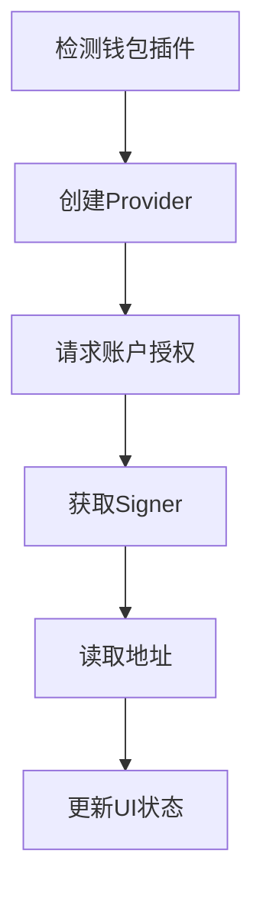

# Web3开发入门：钱包登录功能实现

## 一、引言

随着区块链技术的不断发展，Web3 应用越来越普及。在这些应用中，钱包登录是一个重要的功能，它允许用户使用自己的加密钱包与应用交互。本文将介绍如何使用 React 和以太坊技术实现一个简单的 Web3 钱包登录功能。

### 功能概述

在Web3 时代，数字钱包是用户进入去中心化世界的关键。我们今天要实现一个简单的 Web3 钱包登录功能，它允许用户通过自己的数字钱包（如 MetaMask）连接到我们的应用，从而进行各种去中心化操作。

## 二、为什么需要这个功能

1. **用户体验** ：对于熟悉 Web3 的用户来说，使用他们习惯的钱包进行登录是一种无缝且便捷的体验。
2. **安全性** ：数字钱包提供了安全的密钥管理，用户无需在我们的应用中存储明文密码。
3. **去中心化** ：符合 Web3 的去中心化理念，用户对自己的数字身份和资产有完全的控制权。

## 三、实现步骤

### 环境准备

在开始之前，确保您已经安装了以下工具和库：

1. Node.js 和 npm：用于运行 JavaScript 项目和管理依赖。
2. React：用于构建用户界面。
3. ethers.js：一个用于与以太坊区块链交互的库。
4. Vite：一个快速的构建工具。

### （一）创建 React 应用

使用 Vite 创建一个新的 React 应用：

```bash
npm create vite@latest
```

选择 React 项目模板，并按照提示完成安装。


### （二）安装依赖

进入项目根目录下，运行以下命令安装所需的依赖：
```bash
npm install 
```

在项目根目录下，安装 ethers.js：

```bash
npm install ethers
```

`ethers` 是一个用于与以太坊区块链交互的库，我们将用它来与用户的数字钱包进行通信。

### （三）编写代码

在 `src` 目录下编辑 `App.jsx` 或 `App.tsx` 文件，并修改以下代码：

```jsx
import { useState } from 'react'
import { ethers } from 'ethers'
import reactLogo from './assets/react.svg'
import viteLogo from '/vite.svg'
import './App.css'

function App() {
const [isConnected, setIsConnected] = useState(false)
const [walletAddress, setWalletAddress] = useState('')

const connectWallet = async () => {
try {
if (window.ethereum) {
const provider = new ethers.BrowserProvider(window.ethereum)
await provider.send("eth_requestAccounts", [])
const signer = await provider.getSigner()
const address = await signer.getAddress()
setIsConnected(true)
setWalletAddress(`${address.slice(0,6)}...${address.slice(-4)}`)
} else {
alert('请安装MetaMask钱包!')
}
} catch (error) {
console.error(error)
}
}

const disconnectWallet = () => {
setIsConnected(false)
setWalletAddress('')
}

return (
<>
<div>
<a href="https://vite.dev" target="_blank">

</a>
<a href="https://react.dev" target="_blank">

</a>
</div>
<h1>Web3 钱包登录</h1>
<div className="card">
<button 
onClick={isConnected ? disconnectWallet : connectWallet}
style={{ marginBottom: '1rem' }}
>
{isConnected ? '断开连接钱包' : '连接钱包'}
</button>
{isConnected && (
<p>已连接钱包：{walletAddress}</p>
)}
</div>
</>
)
}

export default App
```


### （四）代码讲解
1. **引入必要的模块**

在你的 React 组件文件（如 App.jsx）中，引入以下模块：

```javascript
import { useState } from 'react';
import { ethers } from 'ethers';
```

`useState` 是 React 的状态管理钩子，用于管理钱包连接状态和钱包地址等信息。

2. **设置组件状态**

在组件中，添加以下状态变量：

```javascript
const [isConnected, setIsConnected] = useState(false);
const [walletAddress, setWalletAddress] = useState('');
```

`isConnected` 用于判断钱包是否已连接，`walletAddress` 用于存储用户的钱包地址。

3. **连接钱包函数**

编写一个函数，用于连接用户的数字钱包：

```javascript
const connectWallet = async () => {
try {
if (window.ethereum) {
const provider = new ethers.BrowserProvider(window.ethereum);
await provider.send("eth_requestAccounts", []);
const signer = await provider.getSigner();
const address = await signer.getAddress();
setIsConnected(true);
setWalletAddress(`${address.slice(0, 6)}...${address.slice(-4)}`);
} else {
alert('请安装MetaMask钱包!');
}
} catch (error) {
console.error(error);
}
};
```

这里，我们首先检查浏览器是否支持以太坊（即是否安装了 MetaMask 钱包）。如果是，我们创建一个 `BrowserProvider` 实例，用于与钱包通信。然后，我们请求用户授权连接钱包，并获取钱包的签名器和地址。最后，我们更新组件状态，显示钱包已连接和钱包地址。

4. **断开钱包函数**

编写一个函数，用于断开钱包连接：

```javascript
const disconnectWallet = () => {
setIsConnected(false);
setWalletAddress('');
};
```

这个函数很简单，只是将钱包连接状态设置为未连接，并清空钱包地址。

5. **渲染 UI**

在组件的返回部分，添加以下代码：

```javascript
return (
<>
<div>
<a href="https://vite.dev" target="_blank">

</a>
<a href="https://react.dev" target="_blank">

</a>
</div>
<h1>Web3 钱包登录</h1>
<div className="card">
<button 
onClick={isConnected ? disconnectWallet : connectWallet}
style={{ marginBottom: '1rem' }}
>
{isConnected ? '断开连接钱包' : '连接钱包'}
</button>
{isConnected && (
<p>已连接钱包：{walletAddress}</p>
)}
</div>
</>
);
```

这里，我们创建了一个简单的 UI，包含一个按钮，用于连接或断开钱包。根据钱包连接状态，按钮的文本和点击事件会相应改变。如果钱包已连接，还会显示钱包地址。

### （五）运行和测试

1. 启动你的 React 应用：

```bash
npm run dev
```

2. 打开浏览器，访问应用。如果你已经安装了 MetaMask 钱包，点击 “连接钱包” 按钮，你应该会看到 MetaMask 弹出一个授权连接的窗口。授权后，页面会显示你的钱包地址。点击 “断开连接钱包” 按钮，可以断开钱包连接。


## 总结
通过以上步骤，就成功实现了一个简单的 Web3 钱包登录功能。这个功能是进入 Web3 世界的第一步，你可以在此基础上添加更多的 Web3 功能，如与智能合约交互等。希望本文对您有所帮助！


## 开发者手记
### 登录流程示意图




### 步骤1：环境检测

```jsx
if (window.ethereum) {
// 现代浏览器环境
} else {
alert('请安装MetaMask钱包!');
}
```

**开发注意**：在生产环境，建议增加钱包类型检测，就像给你的应用加一层防护罩，确保用户使用的是合适的钱包。

### 步骤2：建立通信桥梁

```jsx
const provider = new ethers.BrowserProvider(window.ethereum);
```

**原理解析**：BrowserProvider就像一个桥梁，封装了与钱包的JSON-RPC通信协议，让信息能够顺畅地在应用和钱包之间传递。

### 步骤3：请求权限

```jsx
await provider.send("eth_requestAccounts", []);
```

**用户视角**：这时，用户会看到钱包授权对话框弹出，就像在问用户：“嘿，我可以使用你的钱包吗？”用户点头同意后，才能继续下一步。

### 步骤4：获取身份凭证

```jsx
const signer = await provider.getSigner();
const address = await signer.getAddress();
```

**安全规范**：永远不要在前端存储私钥，这就像把宝藏的藏宝图随意放在桌上，非常危险。私钥是用户的秘密，应该由用户自己保管。

### 步骤5：状态管理

```jsx
setIsConnected(true);
setWalletAddress(`${address.slice(0,6)}...${address.slice(-4)}`);
```

**UX优化**：短地址显示提升可读性，就像给长串的地址加上了伪装，让用户更容易识别，也更美观。


### 扩展思考

1. 如何显示账户代币余额？
2. 如何在页面上实现多链切换：让用户可以在不同的区块链网络之间自由切换。